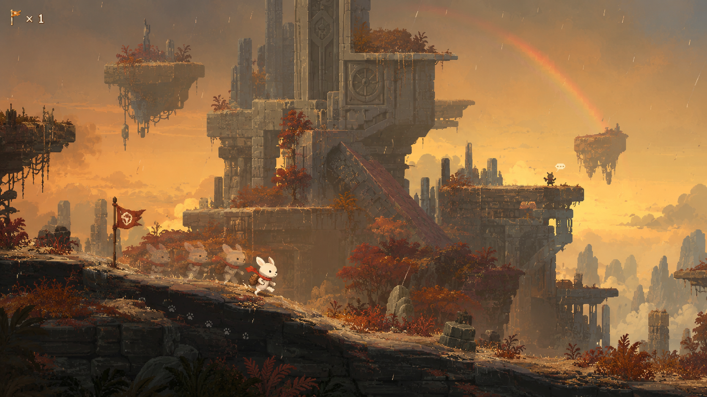

# Project Slit

Project Slit은 CxC Lab에서 진행하는 1인 연구개발 프로젝트입니다.

이중슬릿 실험에서 영감을 받은 `Project Slit`은 현재 내부 코드네임이며 최종 제품명은 아닙니다. 관측되지 않은 세계가 수많은 가능성으로 존재하고, 플레이어가 접근하고 관측하는 순간 하나의 구체적인 공간과 사건으로 나타난다는 상상에서 출발했습니다.

## 프로젝트가 지향하는 경험

Project Slit은 처음부터 거대한 범용 엔진이나 완성된 온라인 게임을 만드는 프로젝트가 아닙니다. 작고 독립적인 기술 실험과 자동화된 테스트를 통해 아이디어를 검증하고, 살아남은 결과만 실제 게임의 기반으로 발전시킵니다.

게임으로 발전할 경우 다음 경험을 지향합니다.

- 낯선 세계를 오래 이동하고 발견하는 경험
- 작고 귀여운 캐릭터와 압도적으로 거대한 세계의 대비
- 날씨, 시간, 지역과 음악이 만들어내는 강한 분위기
- 다른 플레이어와 우연히 마주치고 잠시 동행하는 가벼운 관계
- 제한된 수의 깃발과 흔적을 통해 이루어지는 비동기적 연결
- 퀘스트와 성장 수치보다 이동, 관찰, 발견 자체에서 오는 즐거움

위 이미지는 이러한 방향을 처음 시각화한 콘셉트 아트이며, 최종 게임 화면이나 확정된 구현 사양을 의미하지 않습니다.

## 현재 단계

현재는 게임 제품을 본격적으로 개발하는 단계가 아닙니다.

독립적인 기술 실험과 Unit Test를 준비하고 있으며, 검증된 결과만 향후 게임의 기반으로 발전시킵니다. 기술 스택, 플랫폼, 렌더링 API, 네트워크 구조와 아트 스타일은 아직 확정되지 않았습니다.

## 문서 안내

- [`docs/project-brief.md`](docs/project-brief.md): 프로젝트의 방향, 기술적 가설과 열린 질문
- [`docs/visual-direction.md`](docs/visual-direction.md): 콘셉트 아트에서 읽을 수 있는 비주얼 방향과 검증 질문
- [`docs/decisions/`](docs/decisions/README.md): 중요한 기술 결정의 ADR 기록 방식
- [`experiments/`](experiments/README.md): 독립적인 기술 실험의 계획과 결과
- [`AGENTS.md`](AGENTS.md): 저장소에서 작업할 때 적용할 최소 원칙
