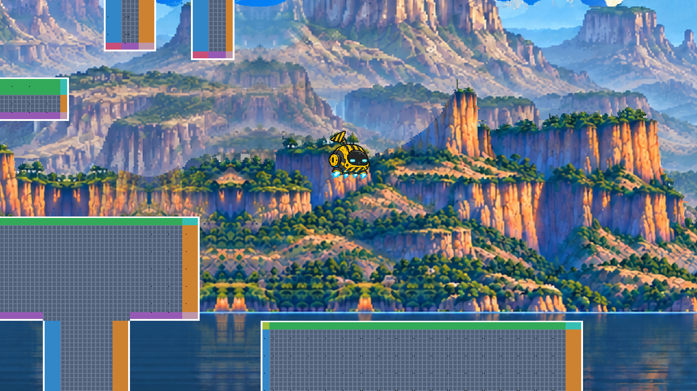

# Project Slit




Project Slit은 CxC Lab에서 진행하는 1인 연구개발 프로젝트입니다.

이중슬릿 실험에서 영감을 받은 `Project Slit`은 현재 내부 코드네임이며 최종 제품명은 아닙니다. 관측되지 않은 세계가 수많은 가능성으로 존재하고, 플레이어가 접근하고 관측하는 순간 하나의 구체적인 공간과 사건으로 나타난다는 상상에서 출발했습니다.

## 프로젝트가 지향하는 경험

Project Slit은 처음부터 거대한 범용 엔진이나 완성된 온라인 게임을 만드는 프로젝트가 아닙니다. 작고 독립적인 기술 실험과 자동화된 테스트를 통해 아이디어를 검증하고, 살아남은 결과만 실제 게임의 기반으로 발전시킵니다.

게임으로 발전할 경우 다음 경험을 지향합니다.

- 낯선 세계를 오래 이동하고 발견하는 경험
- 작고 귀여운 캐릭터와 압도적으로 거대한 세계의 대비
- 날씨, 시간, 지역과 음악이 만들어내는 강한 분위기
- 다른 플레이어와 우연히 마주치고 잠시 동행하는 가벼운 관계
- 제한된 수의 깃발과 흔적을 통해 이루어지는 비동기적 연결
- 퀘스트와 성장 수치보다 이동, 관찰, 발견 자체에서 오는 즐거움

위 이미지는 이러한 방향을 처음 시각화한 콘셉트 아트이며, 최종 게임 화면이나 확정된 구현 사양을 의미하지 않습니다.

## 현재 단계

현재는 게임 제품을 본격적으로 개발하는 단계가 아닙니다.

독립적인 기술 실험과 Unit Test로 아이디어를 검증하고 있으며, 검증된 결과만 향후 게임의 기반으로 발전시킵니다. 기술 스택, 플랫폼, 렌더링 API, 네트워크 구조와 아트 스타일은 아직 확정되지 않았습니다.

### 2026-09-09: 이동 프로토타입이 실행 가능해졌습니다

Windows에서 빌드하고 실행할 수 있는 첫 이동 프로토타입을 만들었습니다. 이동 규칙을 임시 사각형으로 먼저 검증한 뒤, 첫 아바타 후보인 proto_one의 스프라이트를 붙였습니다. 정지와 걷기, 달리기, 방향 전환, 점프와 낙하, 급강하까지 각각의 애니메이션이 있습니다. 아직 스프라이트가 없는 동작은 Idle을 대신 재생합니다. 지형은 계속 임시 사각형이며, 어느 것도 게임의 최종 사양이 아닙니다.

현재 조작할 수 있는 것은 다음과 같습니다.

- 좌우 이동, 점프, 중력, 플랫폼 착지
- 벽 blocking과 wall slide
- 벽에 접촉하면 점프가 다시 가능해지는 연속 벽 점프
- 방향키 더블탭으로 발동하는 8방향 공중 대쉬와 연속 대쉬
- 지상에서 방향키 더블탭 후 방향을 유지하면 발동하는 달리기
- 달리기 속도를 유지한 채 도약하는 점프
- 공중에서 위를 누르고 있으면 천천히 떨어지는 낙하
- 공중에서 아래를 누르고 있으면 빠르게 떨어지는 급강하
- 세로 dead-zone과 smoothing을 적용한 follow camera. 수직 속도가 빠를수록 연속적으로 더 빨리 따라붙습니다. 단계가 나뉘어 있지 않아 화면이 튀지 않고, 걷거나 서 있을 때는 기존과 똑같이 부드럽습니다
- 그냥 떨어질 때의 낙하 속도에도 상한이 생겨 급강하가 실제로 더 빠릅니다. 착지 애니메이션은 그대로 나옵니다
- 정지하면 Idle, 걸으면 Walking, 달리면 Sprinting으로 바뀌는 proto_one 애니메이션. 셋 다 4프레임이며 달리기만 두 배 빠르게 넘어갑니다
- 좌우 방향을 바꾸면 재생되는 3프레임 Turn 애니메이션. 이동이나 점프 중에도 방향을 바꿀 수 있습니다
- 점프하면 한 번 재생되는 3프레임 Jumping, 떨어지는 동안 반복되는 3프레임 Falling 애니메이션
- 공중에서 아래를 누르고 있으면 재생되는 2프레임 FastFalling 애니메이션
- 공중 대쉬 동안 한 번 재생되는 3프레임 AirDashing 애니메이션. 연속으로 대쉬하면 매번 처음부터 다시 재생됩니다
- 위를 누른 채 천천히 떨어질 때의 2프레임 SlowFalling, 벽을 타고 내려올 때의 4프레임 WallSliding 애니메이션
- 빠르게 떨어져 땅에 부딪히면 한 번 재생되는 4프레임 Landing 애니메이션. 평범한 점프 착지에서는 나오지 않고, 착지 직후 바로 움직이면 즉시 취소됩니다
- 모니터 해상도를 그대로 쓰는 테두리 없는 전체 화면
- 창 제목에 표시되는 현재 이동 상태

이동 수치는 모두 플레이 테스트용 후보값이며 확정 사양이 아닙니다. 자세한 내용은 [`docs/project-brief.md`](docs/project-brief.md)의 이동과 공중 행동 가설 항목과 [`experiments/`](experiments/README.md)의 진행 상황을 참고하세요.

### 2026-09-12: 첫 월드의 배경이 붙었습니다

첫 번째 월드의 테마를 Avatar Lake 로 정했습니다. 기아나 고지를 모티브로 한 거대한 사각 테푸이 절벽, 가늘고 긴 폭포, 커다란 구름이 떠 있는 밝은 하늘, 절벽을 비추는 잔잔한 호수입니다.

첫 번째 월드 Avatar Lake 에 시차 배경 레이어를 붙였습니다. 카메라가 움직이면 하늘, 먼 절벽, 가까운 절벽과 호수가 서로 다른 속도로 흘러갑니다.

배경은 지역 파일과 같은 이름의 별도 데이터 파일에 있습니다. 고친 뒤 다시 실행하면 바로 반영되며, 다시 빌드하지 않습니다. 배경을 그리는 코드는 하늘이나 호수 같은 역할 이름도 레이어 개수도 알지 못합니다.

세 레이어 모두 실제 아트입니다. 다만 시차 속도와 레이어 개수는 아직 확정하지 않았고, 지형은 계속 임시 회색 상자입니다.

처음에는 넓은 공간에서 거리와 높이를 읽으려고 월드 좌표에 고정된 격자와 랜드마크를 함께 그렸습니다. 배경이 그 역할을 하게 되면서 걷어냈습니다.

### 빌드와 실행

Windows x64에서 Visual Studio 2022의 C++ 개발 도구, CMake 3.28 이상, Git이 필요합니다. 최초 구성 시 SFML을 내려받으므로 인터넷 연결이 필요합니다.

```
cmake -S . -B build -G "Visual Studio 17 2022" -A x64
cmake --build build --config Release
.\build\Release\project_slit.exe
```

인자 없이 실행하면 연습실에서 시작합니다. 첫 번째 월드인 Avatar Lake 를 보려면 지역 이름을 넘깁니다. 지형은 아직 임시 회색 상자입니다.

```
.\build\Release\project_slit.exe avatar_lake
```

개발 중에는 같은 일을 하는 스크립트를 써도 됩니다. 기본 지역은 계속 연습실입니다.

```
.\tools\run_avatar_lake.bat
```

회귀 테스트는 CTest로 실행합니다.

`region_tests`는 모든 지역 JSON의 스폰 겹침과 10단위 격자의 각 위치에 실제 플레이어 충돌 상자를 놓아 통행 가능성을 검사하고, 스폰에서 4방향으로 연결되지 않는 위치를 찾습니다. 폭이 플레이어보다 좁은 통로는 통과시키지 않으며, 격자 정렬 때문에 폭이 정확히 32인 통로도 막힌 것으로 보수적으로 판정될 수 있습니다. 통과는 좌표 실수로 봉인된 방을 만드는 것을 방지하기 위한 결과일 뿐, 이동 도달 가능성·재미·구도·난이도·동선의 품질을 보증하거나 사람의 플레이 판정을 대신하지 않습니다.

```
ctest --test-dir build -C Release
```

조작은 이동 `A` `D` 또는 `←` `→`, 점프 `Space`이며, 같은 방향을 빠르게 두 번 누르면 지상에서는 달리기, 공중에서는 대쉬가 발동합니다. 공중 대쉬의 세로 입력은 `W` `S` 또는 `↑` `↓`를 함께 사용합니다. 위아래를 두 번 누르지 않고 계속 누르고 있으면 대쉬 대신 낙하 속도가 바뀝니다.

`F12`를 누르면 현재 화면 PNG와 좌표 JSON이 `build/preview/captured_XXXX.*`에 함께 저장됩니다.

실행하면 곧바로 전체 화면으로 시작하고 마우스 커서를 숨깁니다. 다른 창으로 넘어가면 커서가 돌아옵니다. `Alt` + `Enter`로 창 모드와 전체 화면을 오갈 수 있습니다. 전체 화면은 모니터 해상도를 그대로 쓰고 검은 여백 없이 화면을 채웁니다. 기준 구도를 균일하게 확대하므로 그림이 늘어나지 않고, 화면비가 기준과 다르면 넘치는 부분이 잘립니다. 화면이 커져도 캐릭터가 작아지지 않습니다. 자세한 내용은 [`docs/decisions/0005-display-and-view-policy.md`](docs/decisions/0005-display-and-view-policy.md)에 있습니다.

현재 이동 상태는 창 제목에 실시간으로 표시되므로 별도 디버그 도구 없이 확인할 수 있습니다.

### 월드를 그림으로 살펴보기

Avatar Lake는 가로 열두 화면 세로 열두 화면, 모두 144화면입니다. 지형을 확인하려고 매번 그 자리까지 날아갈 수는 없으므로, 카메라 좌표를 주면 그 자리의 화면을 PNG로 뽑아 주는 개발용 도구를 함께 둡니다. 게임 실행 파일과는 별개이며 플레이에 관여하지 않습니다.

```
.\tools\preview_avatar_lake.bat
```

`--cover`로 지역 경계와 화면 크기에서 격자를 계산해 빈틈없이 촬영합니다. 결과는 `build/preview/<지역>/`에 나옵니다.

- `overview.png`: 전체를 한눈에 봅니다. 칸마다 `R01-C01` 형식의 번호가 붙습니다. `R01`이 하늘, `R12`가 호숫가입니다
- `rows/R01.png` ~ `R12.png`: 한 행을 가로로 이어 붙인 원본 해상도입니다. 지형을 뜯어볼 때 씁니다
- `cells/`: 칸 하나씩의 원본 이미지입니다
- `manifest.json`: 칸 번호와 실제 월드 좌표의 대응표입니다

원본 전체를 한 장으로 붙이면 9600x5400, 약 5200만 픽셀이 되어 열기 어렵습니다. 그래서 행 단위로 나눕니다.

특정 좌표만 보려면 카메라 중심을 직접 넘깁니다. 숫자 쌍 하나가 한 장면이며 간격이 아닙니다.

```
.\build\Release\preview.exe avatar_lake 400,375 5000,-2000 --sheet --grid
```

`--grid`는 캐릭터 크기 상자와 월드 격자, 좌표 눈금을 덧그립니다. 빼면 게임과 똑같은 화면이 나옵니다. `--aspect 4:3`으로 창 모드 구도도 볼 수 있습니다.

보이는 범위와 그리는 순서를 게임과 같은 코드에서 가져오므로 미리보기와 실제 화면이 어긋나지 않습니다.

## 문서 안내

- [`docs/project-brief.md`](docs/project-brief.md): 프로젝트의 방향, 기술적 가설과 열린 질문
- [`docs/visual-direction.md`](docs/visual-direction.md): 콘셉트 아트에서 읽을 수 있는 비주얼 방향과 검증 질문
- [`docs/animation-policy.md`](docs/animation-policy.md): 플레이어 스프라이트 제작과 이동 애니메이션 정책
- [`docs/background-asset-contract.md`](docs/background-asset-contract.md): 시차 배경 레이어 이미지의 제작 규격
- [`docs/decisions/`](docs/decisions/README.md): 중요한 기술 결정의 ADR 기록 방식
- [`experiments/`](experiments/README.md): 독립적인 기술 실험의 계획과 결과
- [`src/`](src): 현재 이동 프로토타입 구현
- [`assets/regions/`](assets/regions): 지역의 경계와 발판 배치. 고친 뒤 다시 실행하면 바로 반영됩니다
- [`assets/backgrounds/`](assets/backgrounds): 지역별 시차 배경 레이어. 지역 파일과 같은 이름을 씁니다
- [`tools/`](tools): 월드 구도 미리보기 도구, 검증용 배경 이미지 생성기, 개발용 실행 스크립트
- [`tests/`](tests): 이동과 카메라의 회귀 테스트
- [`AGENTS.md`](AGENTS.md): 저장소에서 작업할 때 적용할 최소 원칙
